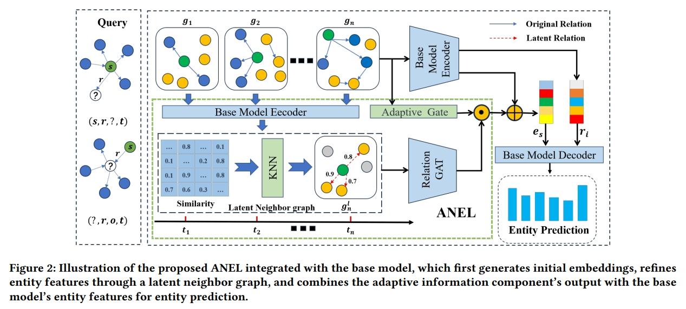

# Tackling Sparse Facts for Temporal Knowledge Graph Completion



## Quick Start
### Environment variables & dependencies
```
conda create -n ANEL python=3.8`
conda activate ANEL
```

### Process data

#### For the four datasets ICEWS18, ICEWS14, ICEWS05-15 and GDELT, go into the dataset folder in the ./data directory and run the following command to construct the static graph.
```
cd ./data/<dataset>
python ent2word.py
```
### Train models

#### Then the following commands can be used to train the proposed models. By default, dev set evaluation results will be printed when training terminates.

#### 1. Make dictionary to save models
```
mkdir models
```
#### 2. Train models
```
cd src
python main.py -d ICEWS14 --densify_k 6 --train-history-len 9 --test-history-len 9 --dilate-len 1 --lr 0.001 --n-layers 2 --evaluate-every 1 --gpu=0 --n-hidden 200 --self-loop --decoder convtranse --encoder uvrgcn --layer-norm --weight 0.5  --entity-prediction --relation-prediction --add-static-graph --angle 10 --discount 1 --task-weight 0.7 --gpu 0 --n-epochs 300
```
